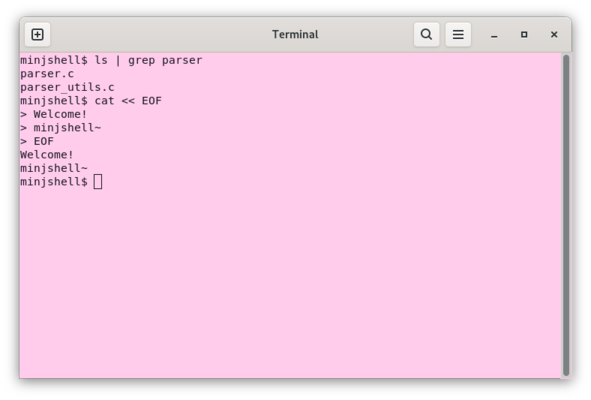

# Minjshell

<br/>
<br/>

# 0. Project Overview (프로젝트 개요)
- 프로젝트 이름: minjshell
- 프로젝트 설명: bash 쉘의 미니 버전 구현 
(입력 문자열을 파싱하여 명령어와 리다이렉션 구조체로 분리하고,<br> 
단일 명령, 파이프, 빌트인/외부 명령 실행, fork/exec, 리다이렉션, 히어독을 처리)


<br/>
<br/>

# 1. Getting Started (시작하기)
```bash
$ make
$ ./minjshell
```

<br/>
<br/>

# 2. Team Members (팀원 및 팀 소개)
| jeong | ji |
|:------:|:------:|
|  |  |
| Parsing 담당 | Execution 담당 |
| - 사용자 입력 문자열 파싱 및 토큰화<br>- 명령어 구조체와 리다이렉션 구조체 생성<br>- 히어독(Heredoc) 전처리 구현<br>- 에러 처리 및 예외 상황 관리 | - 단일 명령어 실행 구현<br> (외부 명령어, 빌트인 명령어)<br>- 파이프 구현 및 부모-자식 프로세스 관리<br>- 리다이렉션 처리 구현 (>, >>, <)<br>- 히어독 입력과 실행 연결 |
| [@jojuma1325](https://github.com/jojuma1325) | [@eegnim](https://github.com/eegnim) |

<br/>
<br/>

# 3. Key Features (주요 기능)
- **명령어 입력 처리**:
  - 사용자 입력을 파싱하여 명령어와 리다이렉션 구조체로 분리합니다.
  - 여러 명령어를 한 줄에 입력해도 파이프와 연계하여 처리할 수 있습니다.

- **단일 명령어 실행**:
  - 외부 명령어를 실행합니다. (ls, cat, grep, mkdir 등)
  - 빌트인 명령어를 실행합니다. (cd, exit, export, unset, env, pwd, echo)

- **파이프라인 처리**:
  - `|` 연산자를 통해 여러 명령어를 연결하여 실행할 수 있습니다.
  - 부모-자식 프로세스를 이용하여 표준 입력/출력 연결을 구현합니다.

- **리다이렉션 처리**:
  - `>`, `>>`, `<` 연산자를 지원하여 파일 입출력을 처리합니다.

- **히어독(Heredoc) 전처리**:
  - `<<` 연산자를 사용한 입력 전처리를 지원합니다.
  - 종료 구분자(delimiter)를 기준으로 입력 내용을 읽어 명령어 실행에 전달합니다.

- **에러 처리**:
  - 잘못된 명령어, 잘못된 구문, 파일 접근 오류 등 예외 상황 처리합니다.
  - 사용자에게 명확한 에러 메시지를 제공합니다.

<br/>
<br/>

# 5. Technology Stack (기술 스택)

## 5.1 Language
|  |  |
|-----------------|-----------------|
| C |  |

<br/>

## 5.2 Platform
|  |  |
|-----------------|-----------------|
| Linux / Bash 환경 |  |

<br/>

## 5.3 Tools & Cooperation
|  |  |
|-----------------|-----------------|
| Git |  |
| VSCode |  |

<br/>

## 5.4 Cooperation
|  |  |
|-----------------|-----------------|
| Git    |      |
| Notion    |      |

<br/>


